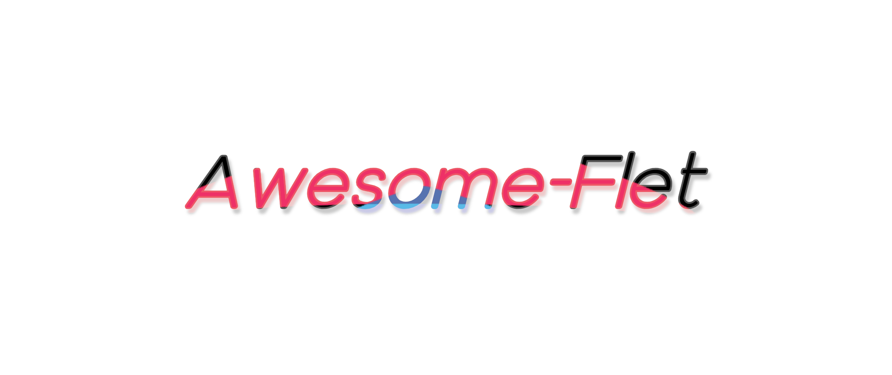

[//]: # (<h1 align="center">Awesome Flet</h1>)

  

A curated list of apps, extensions, libraries, and resources for <a href="https://flet.dev">Flet</a> — build multi-platform apps in Python, powered by Flutter.

## Contents

- [Getting Started](#getting-started)
- [Published Apps](#published-apps)
- [Extensions](#extensions)
  - [Official Extensions](#official-extensions)
  - [Community Extensions](#community-extensions)
- [Libraries](#libraries)
- [Apps and Projects](#apps-and-projects)
- [Tools](#tools)
  - [IDE Plugins](#ide-plugins)
- [Learning Resources](#learning-resources)
- [Community](#community)
- [Contributing](#contributing)

## Getting Started

Everything you need to install Flet, learn the basics, and publish your first app.

- [Flet](https://flet.dev) - Official website with documentation, roadmap, tutorials, examples, blog, and changelog.
- [Flet Studio](https://flet.app) - A full-featured Python IDE in the browser, built with Flet.
- [Publishing for Android/iOS/macOS/Windows/Linux/Web](https://flet.dev/docs/publish/) - Official guide to packaging and shipping Flet apps to all platforms.

## Published Apps

Flet apps shipped to one or more public app stores.

| App               | Description                                                                                                                 | Platforms     | Install                                                                                                                                                                      | Source                                          |
|-------------------|-----------------------------------------------------------------------------------------------------------------------------|---------------|------------------------------------------------------------------------------------------------------------------------------------------------------------------------------|-------------------------------------------------|
| CodeUA            | A daily 9:00 AM minute-of-silence app to collectively commemorate those who lost their lives in the war in Ukraine.         | Android       | [Google Play](https://play.google.com/store/apps/details?id=org.foundation101.codeua)                                                                                        | -                                               |
| Flet              | Official client to preview and test Flet apps on a device.                                                                  | Android · iOS | [Google Play](https://play.google.com/store/apps/details?id=com.appveyor.flet) · [App Store](https://apps.apple.com/app/flet/id1624979699)                                   | -                                               |
| Just Reserved     | Demo reservation and booking app built with Django and Flet, showcasing the flet-django framework.                          | Android       | [Google Play](https://play.google.com/store/apps/details?id=app.marysia.just_reserved)                                                                                       | -                                               |
| KTV Player        | Live TV player for your own M3U playlists and custom channels.                                                              | Android       | [Google Play](https://play.google.com/store/apps/details?id=ng.kiri.ktvplayer)                                                                                               | [GitHub](https://github.com/Nwokike/ktv-player) |
| Lambs and Tigers  | Digital version of the Aadu Puli Aattam strategy board game — three tigers against fifteen lambs, with AI and online modes. | Android · iOS | [Google Play](https://play.google.com/store/apps/details?id=com.aakattutech.LambsAndTigers) · [App Store](https://apps.apple.com/us/app/lambs-and-tigers/id6754126430)       | -                                               |
| Pictograms        | Build pictogram boards to aid communication, with per-user boards of selectable images.                                     | Android       | [Google Play](https://play.google.com/store/apps/details?id=com.pictogram)                                                                                                   | -                                               |
| Spaninsight       | Privacy-first data intelligence — collect, analyze, and report with on-device AI.                                           | Android       | [Google Play](https://play.google.com/store/apps/details?id=com.spaninsight.app)                                                                                             | -                                               |
| TastyFit          | Cooking app with 3,000+ recipes, step-by-step guides, and filters by ingredient, cuisine, and occasion.                     | Android       | [Google Play](https://play.google.com/store/apps/details?id=com.tastyfit.tastyfit)                                                                                           | -                                               |
| Text to Speech AI | Converts text into natural-sounding speech using AI, with multilingual support and audio export.                            | Android       | [Google Play](https://play.google.com/store/apps/details?id=com.mycompany.texttospeech)                                                                                      | -                                               |
| TripCalc          | Calculates the total cost of a trip, including gas, tolls, and miles driven.                                                | Android · iOS | [Google Play](https://play.google.com/store/apps/details?id=com.BernerTech.tripcalcapp) · [App Store](https://apps.apple.com/app/tripcalc-trip-cost-calculator/id6741445615) | -                                               |

## Extensions

Extensions add new controls and native capabilities by wrapping Flutter packages and platform APIs. 
See this [guide](https://flet.dev/docs/extend/user-extensions/) to build your own extensions, then [open a PR](#contributing) to this repo to have it listed here.

### Official Extensions

Built and actively maintained by the Flet team.

- [flet-ads](https://github.com/flet-dev/flet/tree/main/sdk/python/packages/flet-ads) - Google AdMob ads. Wraps [`google_mobile_ads`](https://pub.dev/packages/google_mobile_ads).
- [flet-audio](https://github.com/flet-dev/flet/tree/main/sdk/python/packages/flet-audio) - Audio playback. Wraps [`audioplayers`](https://pub.dev/packages/audioplayers).
- [flet-audio-recorder](https://github.com/flet-dev/flet/tree/main/sdk/python/packages/flet-audio-recorder) - Microphone audio recording. Wraps [`record`](https://pub.dev/packages/record).
- [flet-camera](https://github.com/flet-dev/flet/tree/main/sdk/python/packages/flet-camera) - Device camera access. Wraps [`camera`](https://pub.dev/packages/camera).
- [flet-charts](https://github.com/flet-dev/flet/tree/main/sdk/python/packages/flet-charts) - Interactive charts and graphs. Wraps [`fl_chart`](https://pub.dev/packages/fl_chart).
- [flet-code-editor](https://github.com/flet-dev/flet/tree/main/sdk/python/packages/flet-code-editor) - Code editor with syntax highlighting. Wraps [`flutter_code_editor`](https://pub.dev/packages/flutter_code_editor).
- [flet-color-pickers](https://github.com/flet-dev/flet/tree/main/sdk/python/packages/flet-color-pickers) - Color picker controls. Wraps [`flutter_colorpicker`](https://pub.dev/packages/flutter_colorpicker).
- [flet-datatable2](https://github.com/flet-dev/flet/tree/main/sdk/python/packages/flet-datatable2) - DataTable with sticky headers and fixed columns. Wraps [`data_table_2`](https://pub.dev/packages/data_table_2).
- [flet-flashlight](https://github.com/flet-dev/flet/tree/main/sdk/python/packages/flet-flashlight) - Device torch control. Wraps [`flashlight`](https://pub.dev/packages/flashlight).
- [flet-geolocator](https://github.com/flet-dev/flet/tree/main/sdk/python/packages/flet-geolocator) - GPS position and position streams. Wraps [`geolocator`](https://pub.dev/packages/geolocator).
- [flet-lottie](https://github.com/flet-dev/flet/tree/main/sdk/python/packages/flet-lottie) - Lottie animations. Wraps [`lottie`](https://pub.dev/packages/lottie).
- [flet-map](https://github.com/flet-dev/flet/tree/main/sdk/python/packages/flet-map) - Interactive tile-based maps. Wraps [`flutter_map`](https://pub.dev/packages/flutter_map).
- [flet-permission-handler](https://github.com/flet-dev/flet/tree/main/sdk/python/packages/flet-permission-handler) - Request and check device permissions. Wraps [`permission_handler`](https://pub.dev/packages/permission_handler).
- [flet-rive](https://github.com/flet-dev/flet/tree/main/sdk/python/packages/flet-rive) - Rive animations. Wraps [`rive`](https://pub.dev/packages/rive).
- [flet-secure-storage](https://github.com/flet-dev/flet/tree/main/sdk/python/packages/flet-secure-storage) - Native secure key-value storage. Wraps [`flutter_secure_storage`](https://pub.dev/packages/flutter_secure_storage).
- [flet-spinkit](https://github.com/flet-dev/flet/tree/main/sdk/python/packages/flet-spinkit) - Loading spinners. Wraps [`flutter_spinkit`](https://pub.dev/packages/flutter_spinkit).
- [flet-video](https://github.com/flet-dev/flet/tree/main/sdk/python/packages/flet-video) - Cross-platform video player. Wraps [`media_kit`](https://pub.dev/packages/media_kit).
- [flet-webview](https://github.com/flet-dev/flet/tree/main/sdk/python/packages/flet-webview) - In-app WebView. Wraps [`webview_flutter`](https://pub.dev/packages/webview_flutter).

### Community Extensions

Built and maintained by the community. These may be experimental, in early development, not actively maintained or incompatible with your Flet version,
but they highlight the ecosystem's creativity and potential while further demonstrating Flet's extensibility and power.

- [flet-blur](https://github.com/shiena/flet-blur) - Transparency and blur effects. Wraps [`flutter_acrylic`](https://pub.dev/packages/flutter_acrylic).
- [flet-dropzone](https://github.com/shiena/flet-dropzone) - Drop zone control that accepts dropping files to your Flet desktop app. Wraps [`desktop_drop`](https://pub.dev/packages/desktop_drop).
- [flet-gnav-bar](https://github.com/programmersd21/flet_gnav_bar) - Google Nav Bar style animated bottom navigation. Wraps [`google_nav_bar`](https://pub.dev/packages/google_nav_bar).
- [flet-health](https://github.com/brunobrown/flet-health) - Read and write health data from Apple HealthKit and Google Health Connect. Wraps [`health`](https://pub.dev/packages/health).
- [flet-material-symbols](https://github.com/Creeper19472/flet-material-symbols) - Google's Material Symbols icon set for Flet. Wraps [`material_symbols_icons`](https://pub.dev/packages/material_symbols_icons).
- [flet_math](https://github.com/Bbalduzz/flet_math) - Renders LaTeX and TeX math formulas. Wraps [`flutter_math_fork`](https://pub.dev/packages/flutter_math_fork).
- [flet_notifications](https://github.com/Bbalduzz/flet_notifications) - Local and scheduled notifications. Wraps [`flutter_local_notifications`](https://pub.dev/packages/flutter_local_notifications).
- [flet-onesignal](https://github.com/brunobrown/flet-onesignal) - Push notifications and in-app messaging. Wraps [`onesignal_flutter`](https://pub.dev/packages/onesignal_flutter).
- [flet-open-file](https://github.com/creeper19472/flet-open-file) - Open files with the device's native handler app. Wraps [`open_file`](https://pub.dev/packages/open_file).
- [flet-sherpa-onnx](https://github.com/SamYuan1990/flet_sherpa_onnx) - On-device speech-to-text. Wraps [`sherpa_onnx`](https://pub.dev/packages/sherpa_onnx).
- [sparkle_auto_updater](https://github.com/ap4499/sparkle_auto_updater) - Push automatic desktop-app updates. Wraps [`auto_updater`](https://pub.dev/packages/auto_updater).

## Libraries

Community-made reusable packages, frameworks, and components that extend what you can build with Flet — routing, state management, forms, theming, and UI.

- [flet-asp](https://github.com/brunobrown/flet-asp) - Riverpod-inspired reactive state management using atoms, selectors, and actions.
- [flet-cacheimg](https://github.com/ReYaNOW/flet-cacheimg) - Drop-in CacheImage and CacheCircleAvatar controls that cache network images on disk.
- [flet-carousel](https://github.com/naderidev/flet-carousel) - Carousel slider controls.
- [flet-components](https://github.com/Duz-Dev/flet_component) - Collection of pre-styled UI components that extend Flet's native controls.
- [flet-contrib](https://github.com/flet-dev/flet-contrib) - Community-contributed Flet controls.
- [FletCustomRepo](https://github.com/LegendaryPistachio/FletCustomRepo) - Custom components, UI templates, and animation effects.
- [flet-easy](https://github.com/Daxexs/flet-easy) - App framework with routing, middleware, JWT, and route protection.
- [flet-form](https://github.com/50Bytes-dev/flet-form) - User input validation.
- [FletifyHTML](https://github.com/Benitmulindwa/FletifyHTML) - Converts HTML content into Flet code.
- [fletmint](https://github.com/Bbalduzz/fletmint) - Modern, customizable component library.
- [flet-model](https://github.com/fasilwdr/flet-model) - Model-based router with state management, view caching, and event binding.
- [flet-mvc](https://github.com/o0Adrian/flet-mvc) - Model-View-Controller structure with reactive datapoints and a scaffolding CLI.
- [flet_navigator](https://github.com/xzripper/flet_navigator) - Router for building multi-page apps.
- [flet_pb_v_calc](https://github.com/xzripper/flet_pb_v_calc) - Progress bar value calculator.
- [flet-popupmenu](https://pypi.org/project/flet-popupmenu/) - Customizable popup-menu control with built-in edit/delete dialogs and dynamic forms.
- [flet_restyle](https://github.com/xzripper/flet_restyle) - Styling utilities for Flet apps.
- [flet-route](https://github.com/saurabhwadekar/flet_route) - ExpressJS-style dynamic routing with URL path parameters.
- [FletRouter](https://github.com/50Bytes-dev/flet-router) - FastAPI-style routing for Flet.
- [flet-stack](https://github.com/fasilwdr/flet-stack) - Decorator-based routing with automatic view stacking.
- [flet-stacked](https://github.com/omamkaz/flet-stacked) - Control for managing multiple pages with animated transitions.
- [Flet StoryBoard](https://github.com/SKbarbon/Flet_StoryBoard) - Visual UI builder for Flet front-ends.
- [flet-toast](https://github.com/webtechmoz/flet-toast) - Customizable toast notifications with configurable position and duration.
- [flet-wcolors](https://github.com/omamkaz/flet-wcolors) - Named color collection for use in apps.
- [flet-wizards](https://github.com/Alisonsantos77/flet-wizards) - Ready-made multi-step wizard templates with reactive state and theming.
- [FletX](https://github.com/AllDotPy/FletX) - GetX-inspired reactive framework: state management, routing, dependency injection, and a CLI.
- [fluentflet](https://github.com/Bbalduzz/fluentflet) - Microsoft Fluent Design System component library.
- [neumoflet](https://github.com/Benitmulindwa/neumoflet) - Generates neumorphic-design UI code.
- [persian-datepicker](https://github.com/AliAminiCode/flet-persian-datepicker) - Persian (Shamsi/Jalali) date picker with RTL support, theming, and keyboard navigation.

## Apps and Projects

Community-made open-source apps and projects built with Flet — browse them to learn by example or see what's possible.

- [AIChat](https://github.com/Hayashi-Yudai/aichat) - Customizable AI chat application.
- [Amacapy](https://github.com/sulasoft/Amacapy-Bot-Telegram-Amazon-Affiliates) - Amazon affiliate scraper and Telegram bot with a Flet UI.
- [BillyGPT](https://github.com/B1lli/BillyGPT) - Free, cross-platform ChatGPT client.
- [Bookkeeping Assistant](https://github.com/jmzdd/Bookkeeping-Assistant) - Small bookkeeping and hourly-rate calculator.
- [Bro-Bot-AI](https://github.com/UnnatMalik/CHAT-BOT) - App for exploring AI chatbot technologies.
- [Calculator](https://github.com/taaaf11/Calculator) - Minimal calculator app.
- [flet-alchemy](https://github.com/nbilbo/flet-alchemy) - Example integrating Flet with SQLAlchemy.
- [Flet Base](https://github.com/TonyXdZ/flet-base) - Starter app with multiple pages and basic auth to jump-start a project.
- [flet_projects](https://github.com/LineIndent/flet_projects) - Collection of applications built with Flet.
- [flet-timer](https://github.com/omamkaz/flet-timer) - Example countdown timer using threads for real-time updates.
- [iBackep](https://github.com/redromnon/iBackep) - Lightweight GUI backup manager for iPhone and iPad on Linux.
- [Ki-nTree](https://github.com/sparkmicro/Ki-nTree) - Fast part creation for KiCad and InvenTree.
- [myPeriod](https://codeberg.org/etux/myPeriod) - Menstrual cycle tracking app.
- [Organo](https://github.com/Benitmulindwa/organo) - Generates organic structures from their IUPAC names.
- [PyGem](https://github.com/jorge-lgclabs/PyGem) - Adaptation of the board game Splendor.
- [RetScape](https://codeberg.org/etux/RetScape) - Graphical NomadNet page browser.
- [Simple Stopwatch](https://github.com/taaaf11/Simple-Stopwatch) - A simple stopwatch.
- [Solitaire-on-python](https://github.com/makhmud-dev/Solitaire-on-python) - Solitaire card game.
- [TAICHI-flet](https://github.com/moshstudio/TAICHI-flet) - Windows desktop app for browsing images, music, novels, and comics.

## Tools

Utilities and integrations that improve the Flet development workflow.

- [figmaflet](https://github.com/Benitmulindwa/figmaflet) - Generates Flet UI code from Figma designs via the Figma API.
- [flet-mcp-server](https://github.com/Nwokike/flet-mcp-server) - MCP server that serves official Flet docs and package info to AI agents.
- [flet-pkg](https://github.com/brunobrown/flet-pkg) - CLI that scaffolds Flet extension packages from Flutter packages.
- [flet-splash](https://github.com/brunobrown/flet-splash) - CLI that injects native splash screens into Flet apps during the build.
- [pyflet](https://github.com/webtechmoz/pyflet) - CLI for scaffolding and managing Flet web projects.

### IDE Plugins

Editor and IDE plugins for development of Flet apps.

- [Flet control wrap](https://github.com/50Bytes-dev/vscode-flet-wrap) - VS Code extension for wrapping Flet controls inside other controls.

## Learning Resources

Articles, tutorials, and videos for learning Flet.

#### Articles and Blog posts

Written tutorials, guides, and deep-dives.

- [A Brief Intro to FLET: Building Flutter Apps with Python](https://hackernoon.com/a-brief-intro-to-flet-building-flutter-apps-with-python)
- [Tutorial: Build a Markdown Editor Flutter App With the Flet Python Framework](https://betterprogramming.pub/building-a-markdown-editor-previewer-with-flet-7d9b06d6dc4b)

#### Videos

Video tutorials and walkthroughs.

- [Access any Flet's Control Parent](https://www.youtube.com/watch?v=5GtSwXP3dfY)
- [Adding Navigation To Your Python App (Flet Tutorial)](https://www.youtube.com/watch?v=ZNuHDvt3Oxc)
- [Building the CupertinoNavigationBar Flet Control | Flet Contribution](https://www.youtube.com/watch?v=7ncWtV-8gis)
- [Create A Login Screen In Python With Flet (Tutorial)](https://www.youtube.com/watch?v=YWUM1Yx79mE)
- [Create Your First Python Application With Flet (Tutorial)](https://www.youtube.com/watch?v=-mZP91Y3naY)
- [Creating A Python App With Keyboard Shortcuts (Flet Tutorial)](https://www.youtube.com/watch?v=KFZ_fO_HCMA)
- [Deploy Python Web Apps for FREE on Cloudflare Pages](https://www.youtube.com/watch?v=cr2bhBfgdbg)
- [Deploy Python Web Apps for FREE on GitHub Pages using GitHub Actions](https://www.youtube.com/watch?v=qjHgRwQHD3s)
- [Disable/Enable Browser Context Menu in a Flet Web App](https://www.youtube.com/watch?v=4NhBaxHqgWo)
- [Display Google Admob Banner & Interstitial Ads in Flet | App Monetization](https://www.youtube.com/watch?v=CgScZlh_xRs)
- [Display Interactive Maps in Python using Flet | Part 1](https://www.youtube.com/watch?v=opKXJROXwX8)
- [Display Interactive Maps in Python using Flet | Part 2](https://www.youtube.com/watch?v=wUwQlrXgdcU)
- [Flet Troubleshooting: Fix TextField Content Going Invisible When Resized](https://www.youtube.com/watch?v=esQAs998J5U)
- [How To Build A Card Holder (Wallet) Python + Flet + Async SQLite](https://www.youtube.com/watch?v=o2wXHbPHClA)
- [How To Create A Cool Notepad App In Python (Flet Tutorial)](https://www.youtube.com/watch?v=2o2Gu-QO0b8)
- [How To Create REUSABLE App Components In Python (Flet Tutorial)](https://www.youtube.com/watch?v=ku_HZdgaOF8)
- [How To Hot Reload Your Python App (Flet Tutorial)](https://www.youtube.com/watch?v=IJrvi9A0dzI)
- [How To Use API Endpoints in Python GUI Apps - Flet Tutorial](https://www.youtube.com/watch?v=4sHrAZFY08E)
- [Package Flet Python Apps for ALL Platforms using GitHub Actions](https://www.youtube.com/watch?v=ObO-D2TD_wo)
- [Play & Stream Videos in Python using Flet](https://www.youtube.com/watch?v=zzqRhBzHjSQ)
- [Python Code to Android APK with Flet | Test APK in Virtual Emulator](https://www.youtube.com/watch?v=IcT_QrLWi10)
- [Python Code to Static Web App with Flet](https://www.youtube.com/watch?v=CLzKZlv1IAA)
- [Python OpenAI: Generate A.I. Images Using Python + OpenAI +API + Flet](https://www.youtube.com/watch?v=W5JHJ5kNsZI)
- [Python Tutorial: Movie App + IMDb API Requests](https://www.youtube.com/watch?v=-5xfLcVxD0o)
- [Run & Package Flet Python apps on Google's Project IDX](https://www.youtube.com/watch?v=TiW-JTd4EP0)
- [Set Screen Background Image and Gradient in a Flet Python App](https://www.youtube.com/watch?v=coDwUz90ohk)
- [Simple Ecommerce App in Python - Flet Tutorial](https://www.youtube.com/watch?v=7EtUaP5W7vc)
- [Simple Music Player in Python - Flet Tutorial](https://www.youtube.com/watch?v=hvCEF4OeWzg)
- [Stop Shipping Ugly Python Apps: Tkinter vs Flet in 2026](https://www.youtube.com/watch?v=PDYXDZawwVk)
- [Test Flet Python Apps on Android Mobile Emulator](https://www.youtube.com/watch?v=WSt7YvpwWME)

## Community

Where to ask questions, share what you've built, and connect with other Flet developers.

- [Bluesky](https://bsky.app/profile/fletdev.bsky.social)
- [Discord](https://discord.gg/dzWXP8SHG8)
- [Email us](mailto:hello@flet.dev)
- [GitHub Discussions](https://github.com/flet-dev/flet/discussions)
- [Stack Overflow](https://stackoverflow.com/questions/tagged/flet)
- [X (Twitter)](https://twitter.com/fletdev)

## Contributing

Contributions are welcome! One project per PR, placed in the most specific section (kept alphabetical), with a short, factual description. Published apps go in [`apps.yml`](apps.yml).

See [CONTRIBUTING.md](CONTRIBUTING.md) for the full guidelines and entry formats.
